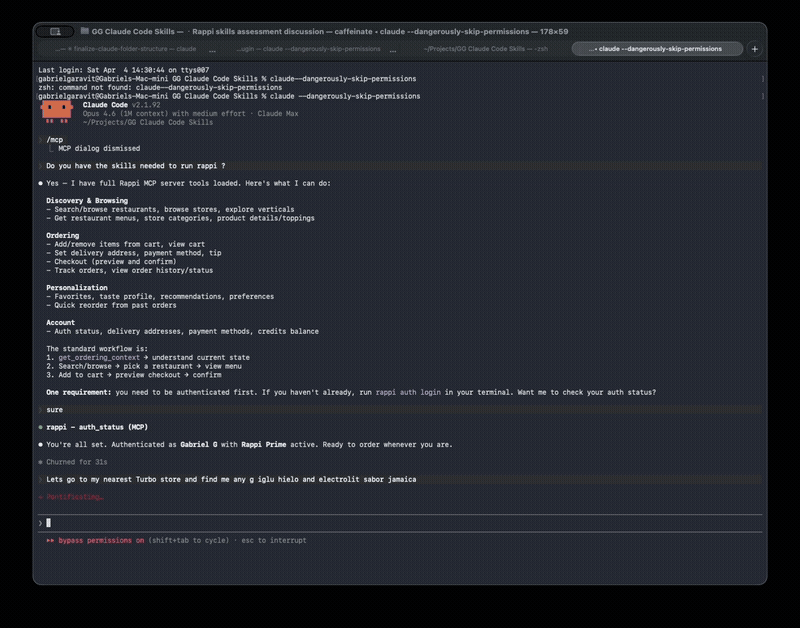
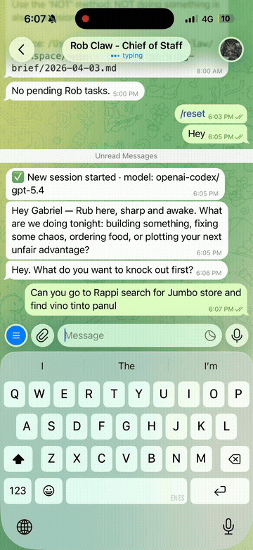

# Rappi Plugin — Claude & OpenClaw

> ## 🇦🇷 Fork con soporte **Argentina**
> Este repositorio es un fork del plugin original que **agrega Argentina** (host `services.rappi.com.ar`).
> 👉 **Guía de uso en español: [GUIA-ARGENTINA.md](GUIA-ARGENTINA.md)**
> Login: `uv run rappi auth login --country ar`
> Fork basado en el excelente trabajo de [Gabriel Garavit](https://github.com/garavitgabriel/rappi-plugin-claude-openclaw) (Colombia/México). Licencia MIT.

---

Order anything from [Rappi](https://www.rappi.com) through conversation. Restaurants, groceries, convenience stores, pharmacies, liquor — if it's on Rappi, you can order it by talking to your AI assistant. The plugin handles searching, browsing, cart management, checkout, and delivery tracking. It learns your preferences over time and gets smarter with every order.

Works on **Claude Code**, **Claude Desktop**, **Claude Cowork** (web), and **[OpenClaw](https://openclaw.ai)**.

Supports **Colombia**, **Mexico**, and **Argentina** 🇦🇷.

<table>
<tr>
<td align="center"><b>Claude Code</b></td>
<td align="center"><b>OpenClaw</b></td>
</tr>
<tr>
<td></td>
<td></td>
</tr>
</table>

## What You Can Do

```
You: "I'm hungry, order me something from that burger place I liked"

Claude: *checks your order history, finds El Corral*
        *suggests items you've ordered before, scored by taste match*
        *adds to cart with your usual toppings*
        *shows checkout summary with suggested tip*

You: "Looks good, place it"

Claude: *places the order, tracks delivery with real-time ETA*
```

```
You: "Find Michelob beer — check Exito and Turbo, whoever has it cheaper"

Claude: *searches both store types, compares prices*
        *Exito: $12,760 for 6-pack | Turbo: $15,480*
        *"Exito has it cheaper — want me to add it to cart?"*
```

```
You: "Get me Tylenol from Farmatodo and a bottle of wine from Carulla"

Claude: *searches both stores in parallel*
        *adds Tylenol PM ($32,900) and Casillero del Diablo ($45,000)*
        *shows combined checkout with delivery fees*
```

The plugin gives your AI assistant **40 tools** across all Rappi store types, **4 workflow skills**, a specialized ordering agent, and a local memory system that builds a taste profile from your order history.

## Store Types

Not just restaurants. The plugin works with every store type on Rappi — cart, checkout, and order tracking automatically detect the correct store type.

| Type | Examples | What You Can Do |
|------|----------|----------------|
| Restaurants | El Corral, McDonald's, local places | Browse menus, customize toppings, reorder favorites |
| Turbo | Turbo convenience stores | Quick snacks, drinks, essentials — delivered in ~10 min |
| Supermarkets | Carulla, Exito, Jumbo, Olimpica | Weekly groceries, compare prices across stores |
| Pharmacies | La Rebaja, Farmatodo | Medicines, personal care products |
| Liquor Stores | Cervesia, Exito Licores | Beer, wine, spirits with age verification |

## Install

### Prerequisites

- Python 3.12+
- [uv](https://docs.astral.sh/uv/)
- A Rappi account (Colombia or Mexico)

### Setup

```bash
git clone https://github.com/garavitgabriel/rappi-plugin-claude-openclaw.git
cd rappi-plugin-claude-openclaw
uv sync
uv run playwright install chromium
```

### Authenticate

```bash
# Colombia (default)
uv run rappi auth login

# Mexico
uv run rappi auth login --country mx

# Headless servers (no browser — SSH, VPS, etc.)
uv run rappi auth token <RAPPI_TOKEN> <DEVICE_ID>
uv run rappi auth token <RAPPI_TOKEN> <DEVICE_ID> --country mx
```

Your token is saved locally at `~/.rappi/config.json`. It never leaves your machine.

### Connect to Your AI Platform

<details>
<summary><b>Claude Code</b> (auto-discovers everything)</summary>

```bash
cd rappi-claude-plugin
claude   # MCP server auto-registers from .mcp.json
```
</details>

<details>
<summary><b>Claude Desktop</b></summary>

Add to `~/Library/Application Support/Claude/claude_desktop_config.json`:
```json
{
  "mcpServers": {
    "rappi": {
      "command": "uv",
      "args": ["run", "--project", "/path/to/rappi-claude-plugin", "rappi-mcp"]
    }
  }
}
```
</details>

<details>
<summary><b>Claude Cowork</b> (web — requires remote MCP server)</summary>

1. Deploy the MCP server (see [Deployment](#deployment))
2. Generate plugin zip: `uv run rappi build-plugin build --url https://your-server.up.railway.app/sse`
3. Upload the zip via Cowork > Customize > Plugins
4. Add the SSE URL as a remote MCP connector
</details>

<details>
<summary><b>OpenClaw</b> (one-command install)</summary>

```bash
cd rappi-claude-plugin
./install-openclaw.sh       # Handles uv, deps, MCP registration, skills
uv run rappi auth login     # Or: rappi auth token <TOKEN> <DEVICE_ID> (headless)
openclaw gateway restart
```

For remote MCP:
```bash
uv run rappi build-plugin build --target openclaw --url https://your-server.up.railway.app/sse
openclaw plugins install ~/Desktop/rappi-openclaw-plugin.zip
openclaw gateway restart
```

See [docs/openclaw-setup.md](docs/openclaw-setup.md) for the full OpenClaw guide.
</details>

## Skills

Just talk naturally. The plugin auto-triggers when you mention food, ordering, stores, or Rappi.

| Skill | Trigger | What It Does |
|-------|---------|-------------|
| `/order-food` | "Order me food", "get me a burger", "find beer at Turbo" | Full workflow: search → browse → cart → checkout → track |
| `/rappi-search` | "What's available?", "find pizza", "search Exito for wine" | Searches all store types, compares prices |
| `/rappi-reorder` | "Order the same as last time" | Re-adds past order items to cart |
| `/rappi-suggest` | "What should I eat?", "suggest something" | Analyzes your taste profile, suggests based on habits and time of day |

## Intelligence & Memory

The plugin stores everything locally in SQLite (`~/.rappi/rappi.db`) and computes a **taste profile** that gets smarter with every order. All data stays on your machine.

### What It Learns

| Data | How It's Used |
|------|--------------|
| Order history | "The usual" per store, reorder patterns, spending trends |
| Product cache | Category preferences (Hamburguesas 40%, Bebidas 25%), favorite items |
| Time patterns | "You usually order lunch at 12:30 on weekdays" |
| Topping choices | "Always adds extra cheese, never onions" |
| Price patterns | Average spend, price sensitivity, tip habits |
| Dietary preferences | Filters recommendations (allergies, restrictions) |

### How It Works Without Embeddings (Default)

Everything runs on **pure SQL** — no external APIs, no cost, no setup:

- **"The usual"** — Products you've ordered 3+ times from a store
- **Time-based suggestions** — Stores you order from at this time of day
- **New store discovery** — Stores matching your preferred type that you haven't tried
- **Menu scoring** — Ranks items by how often you've ordered them
- **Smart search** — SQL LIKE matching across all cached products
- **Taste profile** — Full breakdown of categories, stores, spending, time patterns

### How Embeddings Add Semantic Intelligence (Optional)

Enable [OpenAI embeddings](https://platform.openai.com/docs/guides/embeddings) to unlock meaning-based features on top of the SQL foundation:

```bash
export OPENAI_API_KEY="sk-..."
uv run rappi prefs set embeddings.enabled true
```

| Feature | Without Embeddings | With Embeddings |
|---------|-------------------|-----------------|
| Product search | Keyword matching ("pizza" finds "Pizza Margherita") | Semantic matching ("something refreshing" finds "Sprite", "Limonada") |
| Menu scoring | Frequency-based (items you've ordered before rank higher) | Taste-vector similarity (items *like* what you usually order rank higher) |
| Recommendations | Frequency + time patterns | + "similar products" you haven't tried yet |
| Taste profile | Category %, stores, spending, time patterns | + taste vector (average embedding of all ordered products) |

**How it works:** Each product gets a 1536-dimension vector (text-embedding-3-small). Your taste profile is the average of all products you've ordered. Menu scoring = cosine similarity between each item and your taste vector. All vectors stored as BLOBs in SQLite — no external vector database needed.

**Cost:** ~$0.02 per 1M tokens. A typical menu generates ~100 embeddings. Negligible cost for personal use.

## MCP Tools Reference

<details>
<summary>All 40 tools</summary>

**Discovery & Browsing**
- `explore_verticals` — all available store types in area (Restaurants, Turbo, Markets, Farmacia, Licores)
- `search_restaurants(query)` — search products/stores by keyword (all store types)
- `browse_restaurants(offset, limit)` — nearby restaurants
- `browse_stores(store_type, query)` — find stores by type (turbo, exito, carulla, olimpica, etc.)
- `get_store_categories(store_id)` — browse store aisles/categories
- `get_aisle_products(store_id, aisle_id)` — products in a category
- `get_store_info(store_id)` — hours, charges, address
- `search_store_products(store_id, query)` — CPG product search with brand info
- `search_in_store(store_id, query)` — search within any store

**Menu & Products**
- `get_restaurant_menu(store_id)` — full menu by category
- `get_product_toppings(store_id, product_id)` — customization options

**Cart & Checkout**
- `add_to_cart(store_id, product_id, quantity, topping_ids, product_name, product_price)` — add item
- `view_cart` / `remove_from_cart(store_id, product_id)`
- `get_tip_suggestions` — suggested tip amounts for current cart
- `set_tip(tip_amount)` — set delivery tip in COP (persists until order is placed)
- `checkout(confirm)` — preview then place. Use set_tip before, not during checkout.
- `get_payment_methods` — available payment methods and cards

**Order Tracking**
- `get_active_orders` — currently active orders
- `track_order(order_id)` — real-time state, ETA, driver position
- `get_order_detail(order_id)` — full order summary
- `get_order_breakdown(order_id)` — detailed costs, fees, discounts
- `get_order_status` — active and cancelled orders
- `get_order_history(limit)` — past orders with items

**Account**
- `get_ordering_context` — full state snapshot (user, address, cart, memory)
- `auth_status` — profile and Prime status
- `list_delivery_addresses` / `set_delivery_address(address_id)`
- `get_credits_balance` — Rappi credits/wallet balance
- `get_rappi_favorites` — favorite stores from Rappi
- `get_favorites` / `add_favorite` / `remove_favorite` — local favorites

**Intelligence & Memory**
- `get_taste_profile` — computed taste profile (categories, time patterns, spending)
- `get_recommendations(context?)` — smart suggestions based on habits
- `score_menu(store_id)` — rank menu items by taste match
- `quick_reorder(order_id)` — re-add past order to cart
- `get_preferences` / `set_preference(key, value)`
- `smart_search(query)` — semantic search across cached products

</details>

## Terminal (CLI)

```bash
uv run rappi go                    # Interactive guided ordering
uv run rappi search "hamburguesa"  # Quick search
uv run rappi store detail 900004   # View a store menu
uv run rappi cart show             # View cart
uv run rappi order checkout        # Place order
uv run rappi history               # Past orders
uv run rappi favorites             # Saved stores
uv run rappi prefs                 # Your preferences
```

<details>
<summary>Full CLI command reference</summary>

| Command | Description |
|---------|-------------|
| `rappi go` | Interactive ordering session |
| `rappi auth login` | Authenticate (browser or manual token) |
| `rappi auth token <token> <device_id>` | Set credentials directly (headless) |
| `rappi auth status` | Show profile and Prime status |
| `rappi auth logout` | Clear saved token |
| `rappi address list` | List delivery addresses |
| `rappi address set <id>` | Switch active address |
| `rappi search <query>` | Search restaurants and products |
| `rappi store browse` | Browse nearby restaurants |
| `rappi store detail <id>` | View store info and menu |
| `rappi store toppings <store> <product>` | View product customizations |
| `rappi cart show` | View cart contents |
| `rappi cart add <store> <product>` | Add item with interactive toppings |
| `rappi cart remove <store> <product>` | Remove item from cart |
| `rappi order checkout` | Review and place order |
| `rappi order list` | View active and past orders |
| `rappi order track` | Live order tracking |
| `rappi history` | View order history from memory |
| `rappi favorites` | List favorite stores |
| `rappi prefs` | View preferences |
| `rappi prefs set tip 5000` | Set default tip |

</details>

## Deployment

The MCP server supports two modes:

- **Local (stdio)**: For Claude Code, Claude Desktop, and OpenClaw — runs as a subprocess
- **Remote (SSE over HTTP)**: For Claude Cowork and OpenClaw — deployed to Railway

### Railway Deployment

[](https://railway.com/template/rappi-mcp?referralCode=rappi-claude-plugin)

Or deploy manually:

1. Fork this repo to your GitHub account
2. Connect it to [Railway](https://railway.com) (New Project → Deploy from GitHub)
3. Set environment variables in Railway dashboard:

| Variable | Value | Purpose |
|----------|-------|---------|
| `RAPPI_TOKEN` | `ft.xxxxx` | Auth token from `~/.rappi/config.json` |
| `RAPPI_DEVICE_ID` | UUID | Device ID from config |
| `MCP_TRANSPORT` | `sse` | Enables HTTP transport |
| `RAPPI_COUNTRY` | `co` | Country code: `co` (Colombia) or `mx` (Mexico) |

4. Railway auto-assigns a URL like `https://your-app.up.railway.app`
5. Verify: `curl https://your-app.up.railway.app/health` should return `ok`

Coordinates are auto-synced from your Rappi active address — no need to set lat/lng.

**Get your token and device ID:**
```bash
uv run rappi auth login                    # Authenticate first
cat ~/.rappi/config.json | python3 -c "import json,sys; c=json.load(sys.stdin); print(f'RAPPI_TOKEN={c[\"token\"]}\nRAPPI_DEVICE_ID={c[\"device_id\"]}')"
```

### Plugin Builds

After deploying to Railway:

```bash
# Claude Cowork plugin
uv run rappi build-plugin build --url https://your-app.up.railway.app/sse

# OpenClaw bundle
uv run rappi build-plugin build --target openclaw --url https://your-app.up.railway.app/sse
```

For Cowork: upload the zip via Cowork > Customize > Plugins, then add the SSE URL as a remote MCP connector.
For OpenClaw: `openclaw plugins install ~/Desktop/rappi-openclaw-plugin.zip && openclaw gateway restart`.

## Security

**This plugin can place real orders and spend real money.** The Rappi auth token grants full access to your account — searching, ordering, and paying. Understand what you're enabling:

- **Orders require explicit confirmation** — the AI always previews first and asks before placing
- **Spending limit** — orders over $500,000 COP are blocked by default. Change with `rappi prefs set max_order_amount 1000000`
- **Token storage** — saved locally at `~/.rappi/config.json` (never committed to git)
- **Railway deployment** — your token is stored in Railway's env vars. Use Railway's secrets management
- **No password access** — the plugin only captures the Bearer token, not your Rappi password

## How the API Was Mapped

The Rappi API is undocumented. All 40+ endpoints were reverse-engineered by capturing browser network traffic from rappi.com.co using Chrome DevTools, assisted by [reverse-api-engineer](https://github.com/kalil0321/reverse-api-engineer) — a tool that automatically generates API clients from captured HAR traffic using AI analysis. The full API map is in [API_ENDPOINTS.md](API_ENDPOINTS.md).

### Updating the `app-version` Header

Rappi deploys new versions regularly. If API calls start returning 403 errors:

1. Open your country's Rappi website in Chrome DevTools (Network tab)
2. Look at any API request's `app-version` header
3. Update `APP_VERSION` in `src/rappi/constants.py`
4. Also update `WEB_VERSION` if store browsing breaks

## Development

```bash
uv sync --group dev            # Install dev dependencies
uv run rappi --help            # Test CLI
uv run pytest                  # Run tests
npx @modelcontextprotocol/inspector uv run rappi-mcp  # Test MCP in browser
```

See [CLAUDE.md](CLAUDE.md) for the developer reference, [API_ENDPOINTS.md](API_ENDPOINTS.md) for the full Rappi API map, and [TESTING.md](TESTING.md) for the manual testing checklist.

## Author

**Gabriel Garavit** — [GitHub](https://github.com/garavitgabriel)

Built with Claude Code. API reverse-engineered from Rappi's web app using browser DevTools and [reverse-api-engineer](https://github.com/kalil0321/reverse-api-engineer).

## License

MIT
